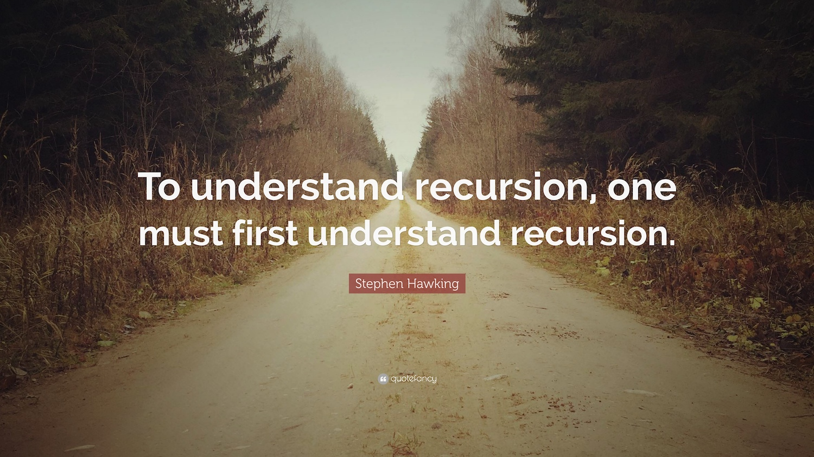

# Programming Languages, Part A

Functional programming and recursion w/ the SML programming language.

Code, notes, and HW solutions for [Programming Langauges, Part A](https://www.coursera.org/learn/programming-languages)

